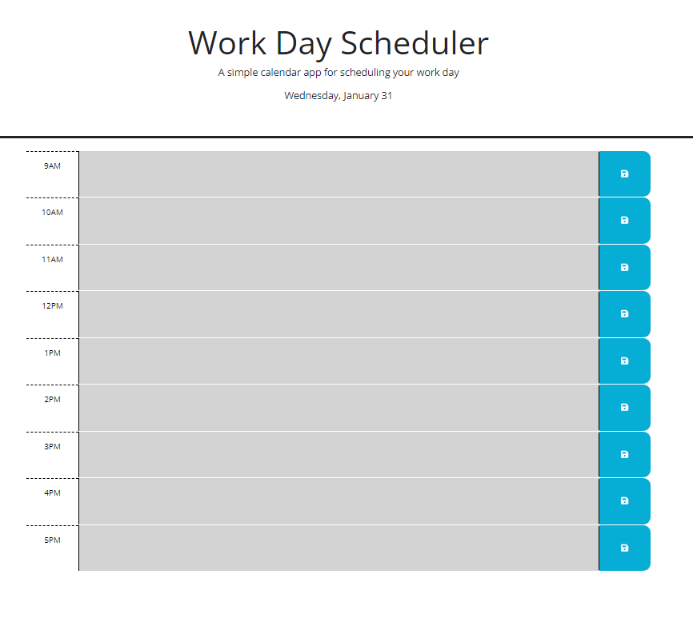

# Work Day Planner

## Overview

A work day planner to write notes based on a certain time block. The current hour time you are in will be green, past time blocks will be grey, and future time blocks will be red. You will be able to make notes in each time block and click save to view your information as you wish. Your notes will remain when the page is refreshed or left and came back to. The user can also view the current date at the top of the page. For this project I was provided some starter code, and built upon that.

## Built With

This is built using HTML, CSS, and JavaScript.

## Installation

To install the code, clone from the GitHub repo to your machine. 

## License

MIT (https://choosealicense.com/licenses/mit/)

## Project Status & Future Features
This is a very simple page that is complete and I do not currently have plans to build upon it. 

Github Repo: https://github.com/NicoleBrubaker/Day-Planner
Live Site: https://nicolebrubaker.github.io/Day-Planner/ 

Screenshot of site, with a blank planner:
